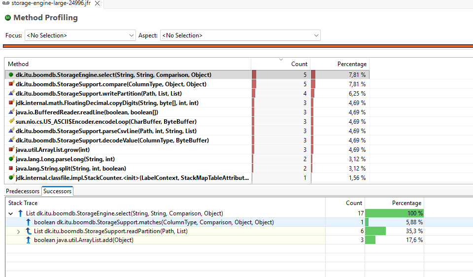
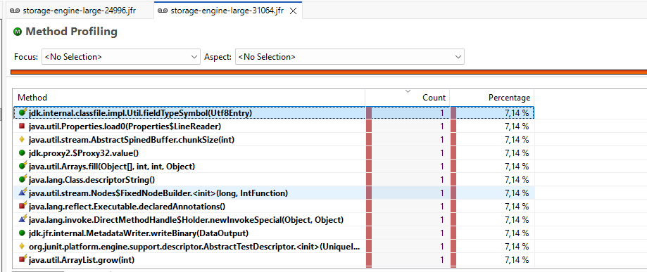

# Selective PAX Scan Optimization

## Summary

The main inefficiency is confirmed: `select` calls `readPartition`, which reads the entire partition and materializes every value into `Object[][]` before applying the predicate. This defeats the PAX layout’s offset directory and allocates decoded values—including temporary `byte[]` objects for every string—for rows that will be discarded.

`compare` is a secondary candidate; it is not the first optimization target.

## Key Changes

- Keep `StorageEngine.select`’s public API, on-disk format, ordering, catalog pruning, scan statistics, and required per-partition log messages unchanged.
- Add a package-private selective partition reader in `StorageSupport` used only by `select`.
    - Read and validate the partition header and column directory.
    - Read/decode the predicate column first and collect matching row indexes.
    - Return immediately without reading non-predicate chunks when there are no matches.
    - Materialize `Object[]` results only for matching rows; decode non-predicate chunks only after matches are known.
    - Preserve on-disk row order and schema column order.
- Retain `readPartition` as the complete partition decoder used by its existing round-trip tests.
- Refactor shared header/directory validation so both readers enforce the same binary-format invariants.
- Remove the per-string temporary byte-array allocation by decoding ASCII strings directly from the backing partition buffer, while advancing the buffer position identically.
- Do not alter `compare`, catalog JSON, the partition format/version, or required debug logging in this change.

## Test Plan

- Add focused `StorageSupport` tests for selective reading:
    - exact matching rows in disk and schema order;
    - no-match result without decoding unrelated column chunks;
    - `STRING`, `LONG`, and `DOUBLE` predicates.
- Preserve existing partition round-trip, comparison, pruning, restart, and integration coverage.
- Update the disabled local profiling workload to include a low-selectivity query such as `distance = 42L`, alongside the full scan, so JFR distinguishes selective-read savings from partition pruning.
- Run focused unit/integration tests and the JFR workload; compare allocation samples and `readPartition`/decode-stack samples before and after. Do not claim a fixed percentage improvement without measured evidence.
- Run `mvn verify` once the unrelated `Engine`/`EngineIT` CSV-name mismatch is resolved.

## Assumptions

- `trips-100mb(in).csv` remains a local, opt-in profiling fixture; normal CI continues to skip the large integration test.
- The current API always returns `SELECT *`, so matching rows still require all output columns; the optimization avoids work for non-matching rows rather than introducing projection.

## AI Fix
Implemented the selective PAX scan optimization.
- select now reads the predicate column first and only materializes complete rows that match.
- No-match partitions avoid reading unrelated chunks.
- Header/directory validation is shared with full readPartition.
- ASCII string decoding no longer allocates a temporary byte[].
- Added focused selective-read tests and updated the opt-in large profiling test with distance = 42L

## Before Fix
- 
## After Fix
